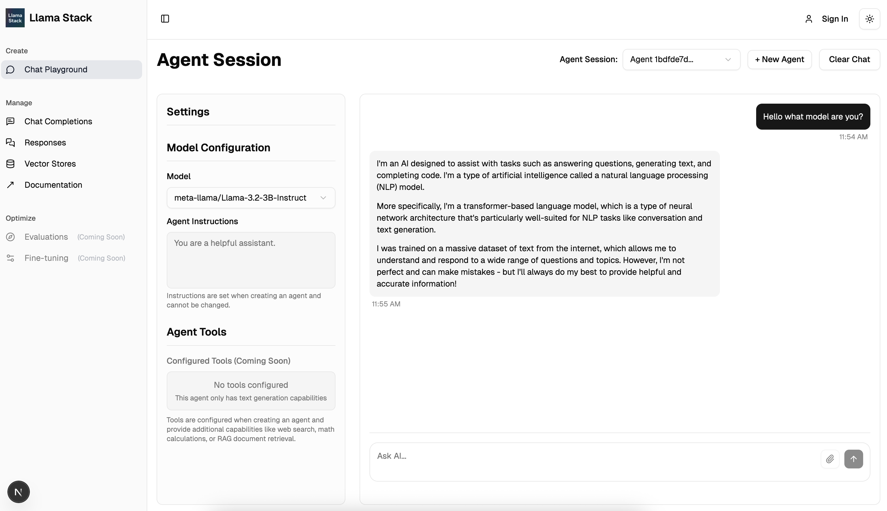
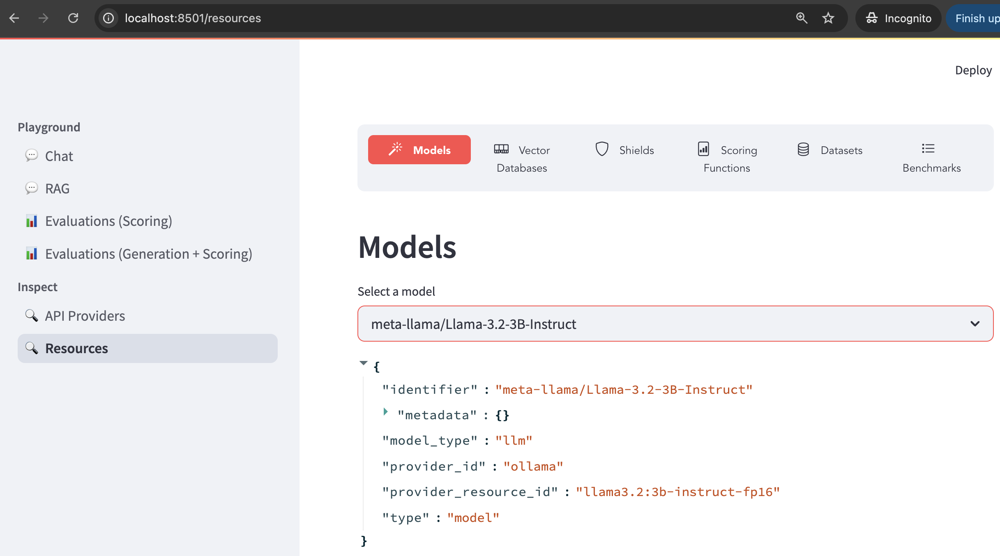
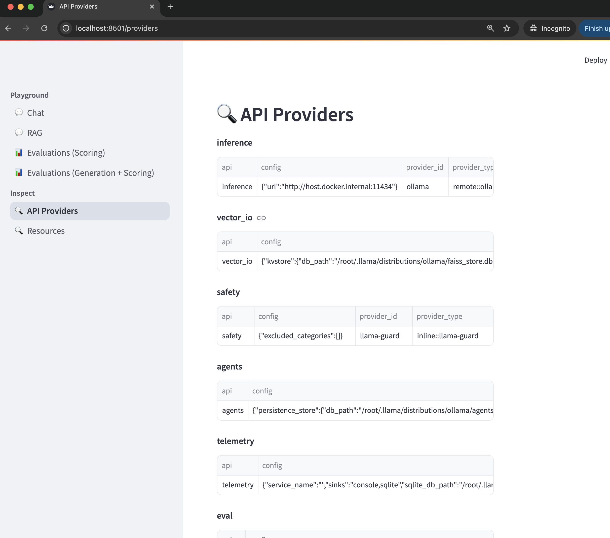

= Llama-stack Playground
:page-layout: lab
:experimental:

== Goal

This module introduces the Llama-Stack Dashboard,  a simple interface designed to showcase the capabilities and concepts of Llama Stack in an interactive environment. 

It provides a UI for inspecting and understanding Llama Stack API providers and resources. Additionally, it includes end-to-end application code to help users get started with building their own applications.

== Prerequisites

* Llama Stack server running (see: xref:beginner-01-helloworld.adoc[Llama-stack Helloworld])
* Python 3.10+ (to install the CLI tool)

== Step 1: Install the LLama-Stack Dashboard

First, set up a virtual environment (optional but recommended):

[source,sh,role=execute]
----
python -m venv llama_env
source llama_env/bin/activate
----

Clone the repository and install the Llama-Stack Dashboard dependencies via pip:

[source,sh,role=execute]
----
git clone https://github.com/meta-llama/llama-stack.git
pip install -r requirements.txt
pip install llama_stack
----

== Step 2: Run the LLama-Stack Dashboard

Start Llama-Stack Dashboard based in the Streamlit UI:

[source,sh,role=execute]
----
streamlit run app.py
----

Automatically, the Llama-Stack Dashboard will be available at `http://localhost:8501`. If not, open your web browser and navigate to `http://localhost:8501` to access the Llama-Stack Dashboard.

== Step 3: Test the LLama-Stack Dashboard Chat

You should see a chat interface where you can interact with the Llama Stack server.

You can enter text prompts and receive responses from the LLM model deployed.

== Step 4: Explore the LLama-Stack Dashboard

The Llama-Stack Dashboard provides a user-friendly interface to explore the available models and providers. You can inspect the models, their configurations, and the providers they are associated with.

To view the available Models, Vector Databases, Shields and others , click on the "Resources" tab in the Llama-Stack Dashboard:

On the other hand you can also view the available API providers available in the Llama-Stack Dashboard by clicking on the "API Providers" tab:

== Summary

In this module, you:

* Installed and deployed the Llama-Stack Dashboard
* Explored the chat interface to interact with the LLM model
* Used the Llama-Stack Dashboard to inspect available models and providers

Next, try using xref:beginner-01-python-programming.adoc[Llama-stack Python Programming] for test your first python program with Llama-Stack.

